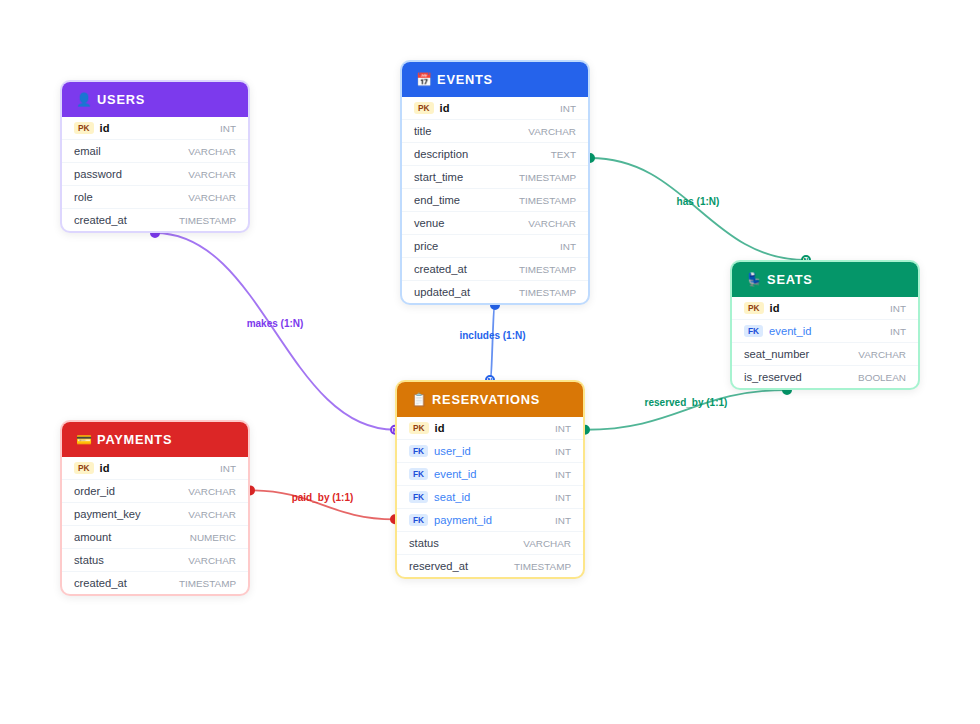

# 실시간 티켓팅 서버 (Spring WebFlux)

## 프로젝트 개요

본 프로젝트는 Spring WebFlux를 기반으로 구축된 고성능 실시간 티켓팅 예매 시스템입니다. 비동기 및 논블로킹(Asynchronous & Non-blocking) 처리를 통해 대규모 트래픽 상황에서도 안정적인 서비스를 제공하는 것을 목표로 합니다.


## 프로젝트 구조

```
src/main/java/org/example/ticketing
├── TicketingApplication.java
├── domain            # 도메인별 비즈니스 로직
│   ├── user
│   ├── event
│   ├── seat
│   ├── reservation
│   ├── payment
│   └── health
├── global            # 전역 설정 및 공통 코드
│   ├── config
│   ├── dto
│   ├── exception
│   └── response
└── security          # JWT 기반 인증/인가
```

## 아키텍처 (Architecture)

### 핵심 흐름: 티켓 예매 (Core Flow: Ticket Reservation)
1.  **사용자 접속 & 대기열 등록**: 사용자가 특정 이벤트 예매를 시작하면, 요청은 먼저 대기열(`EventQueueService`)로 전달되어 Redis Sorted Set에 추가됩니다.
2.  **순번 확인 및 입장**: 클라이언트는 주기적으로 자신의 대기 순번을(`EventQueueController`) 확인하며, 차례가 되면 예매 가능 상태가 됩니다.
3.  **좌석 선택 및 임시 선점**: 사용자가 좌석을 선택하면, 해당 좌석은 `ReservationHoldService`를 통해 일정 시간(예: 3분) 동안 임시로 선점(Hold)됩니다. 이 정보 또한 Redis에 기록됩니다.
4.  **결제 진행**: 사용자는 `TossPaymentService`와 연동된 결제 로직을 통해 결제를 시도합니다.
5.  **결제 승인 및 예약 확정**: 결제가 성공적으로 완료되면, `PaymentController`가 Toss로부터 최종 승인 정보를 받아 `ReservationService`를 호출합니다. 이를 통해 임시 선점 상태였던 좌석은 최종 '예약 완료' 상태로 변경되고, 데이터베이스에 영구 저장됩니다.

## 환경설정 (Configuration)

- **설정 파일**: `application.properties`
- **주요 설정 키**:
```properties
spring.application.name=ticketing

spring.r2dbc.url=r2dbc:postgresql://localhost:5432/ticketing
spring.r2dbc.username=your_db_username
spring.r2dbc.password=your_db_password

spring.mail.host=smtp.gmail.com
spring.mail.port=587
spring.mail.username=your_email
spring.mail.password=your_password
spring.mail.properties.mail.smtp.starttls.enable=true
spring.mail.properties.mail.smtp.starttls.required=true
spring.mail.properties.mail.smtp.auth=true
spring.mail.transport.protocol=smtp

spring.data.redis.host=localhost
spring.data.redis.port=6379

spring.jwt.secret=jwt_secret_key
spring.expiration-ms=604800000

toss.secret.key=your_toss_secret_key
toss.client.key=your_toss_client_key
toss.payments.api-url=https://api.tosspayments.com/v1/payments

reservation.hold-ttl=3m
```
## API 엔드포인트 (API Endpoints)

### User & Auth (`/api/users`)
- `POST /verification-codes?email={email}`: 이메일 인증코드 발송
- `POST /register`: 회원가입
- `POST /login`: 로그인 (JWT 발급)

### Event (`/api/event`)
- `GET /`: 이벤트 목록 조회 (페이지네이션)
- `POST /`: (ADMIN) 이벤트 생성
- `GET /{eventId}`: 이벤트 상세 조회 (대기열 통과 시)
- `PUT /{eventId}`: (ADMIN) 이벤트 수정
- `DELETE /{eventId}`: (ADMIN) 이벤트 삭제

### Event Queue (`/api/queue`)
- `POST /{eventId}`: 이벤트 대기열 등록 요청
- `GET /{eventId}`: 내 대기열 상태(순번) 조회

### Seat (`/api/seat`)
- `GET /{eventId}`: 이벤트별 좌석 목록 조회

### Reservation (`/api/reservation`)
- `POST /{seatId}`: 좌석 임시 선점 요청 (3분)
- `DELETE /{seatId}?token={token}`: 좌석 선점 해제
- `GET /`: 내 예약 목록 조회

### Payment (`/api/payment`)
- `GET /client-key`: Toss Payments 클라이언트 키 조회
- `POST /confirm/{seatId}`: 결제 최종 승인 요청

### Health Check
- `GET /health`: 서버 상태 확인

## ERD


## 데이터 저장소 (Data Storage)

- **Primary Database**: R2DBC를 통해 비동기로 연동된 관계형 데이터베이스(`PostgreSQL`)를 사용합니다. `Event`, `Seat`, `Reservation`, `User`, `Payment` 등의 핵심 엔티티를 저장합니다.
- **In-Memory/Cache**: Redis를 적극적으로 활용합니다.
    - **대기열 관리**: `EventQueueService`가 이벤트별 대기열을 Redis의 `Sorted Set`으로 관리하여 공정한 순서를 보장합니다.
    - **좌석 선점**: `ReservationHoldService`가 좌석 선점 상태를 Redis에 임시로 저장하여 동시성 문제를 해결하고, 만료 처리를 자동화합니다.
    - **이메일 인증**: `EmailVerificationService`가 발급한 인증 코드를 Redis에 임시로 저장하여 관리합니다.
